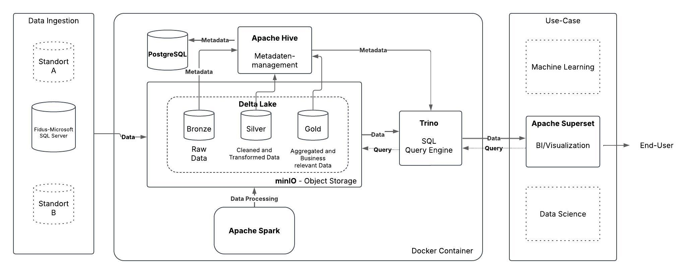

Open source Data Lakehouse with Apache Spark, Delta Lake, Apache Superset, and Docker.

## Docker Commands

### Docker Container

#### Start Data Lakehouse Container
```bash
docker compose up -d
- or -
docker compose up --scale spark-worker=2 -d
```

#### Start Superset Container
```bash
cd superset
docker compose -f docker-compose-image-tag.yml up -d
cd ..
```
